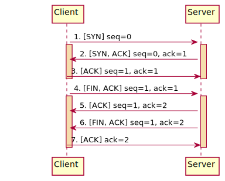
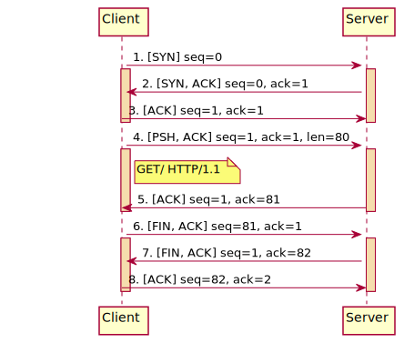
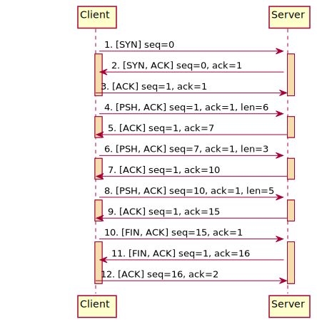

# 使用筆記

- [使用筆記](#使用筆記)
  - [Summary](#summary)
  - [Minitor TCP runtime cycle](#minitor-tcp-runtime-cycle)
  - [Minitor HTTP request runtime cycle](#minitor-http-request-runtime-cycle)
  - [Minitor TCP keep alive runtime cycle](#minitor-tcp-keep-alive-runtime-cycle)
- [Reference](#reference)

---

## Summary

Using wireshark to show entire connection flow.

---

## Minitor TCP runtime cycle

**Start a server thread**

```bash
# 監聽傳入 port 6687 的所有消息
nc -l 6687
```

**Start a client thread**

```bash
# 掃描 port 6687 (i.e. 發出完整的連接/斷開請求, 但不包含資料傳輸)
nc -vz {server_ipa} 6687
```

**Diagram**



---

## Minitor HTTP request runtime cycle

**Start a server thread**

```bash
# 監聽傳入 port 6687 的所有消息
nc -l 6687
```

**Start a client thread**

```bash
# 向指定的 ipa 發送 http request
curl {server_ipa}:6687
```

**Diagram**



---

## Minitor TCP keep alive runtime cycle

**Start a server thread**

```bash
# 監聽傳入 port 6687 的所有消息
nc -l 6687
```

**Start a client thread**

```bash
# 建立一條長連接的 tcp 連線
telnet {server_ipa} 6687
```

**Diagram**



---

# Reference

[Wireshark 中常見的TCP Info](https://www.twblogs.net/a/5b7aa96d2b7177392c968dd2)

[NC 參數說明](https://www.sqlsec.com/2019/10/nc.html)