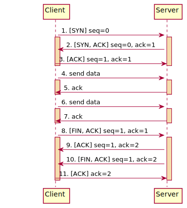

# 使用筆記

using wireshark to performance network flow.

---

## Minitor TCP runtime cycle

### Start a server instance

```bash
nc -l 9000
```

### Start a client instance

```bash
nc -vz 127.0.0.1 9000
```
### Diagram


---

## Minitor HTTP request runtime cycle

### Start a server instance

```bash
nc -l 9000
```

### Start a client instance

```
curl 127.0.0.1:9000
```

### Diagram


---

## Minitor WebSocket runtime cycle

### Start a server instance

```bash
nc -l 9000
```

### Start a client instance

```bash
telnet 127.0.0.1 9000
```

### Diagram



---

# Reference

[Wireshark 中常見的TCP Info](https://www.twblogs.net/a/5b7aa96d2b7177392c968dd2)