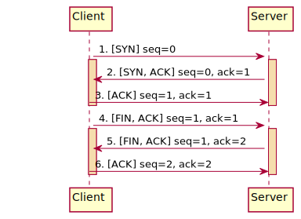

# 使用筆記

Using wireshark to show entire connection flow.

---

## Minitor TCP runtime cycle

### Start a server thread

```bash
# 監聽傳入 port 9000 的所有消息
nc -l 9000
```

### Start a client thread

```bash
# 掃描 port 9000 (i.e. 發出完整的連接/斷開請求, 但不包含資料傳輸)
nc -vz 127.0.0.1 9000
```
### Diagram



---

## Minitor HTTP request runtime cycle

### Start a server thread

```bash
# 監聽傳入 port 9000 的所有消息
nc -l 9000
```

### Start a client thread

```bash
# 向指定的 url 發送 http request
curl 127.0.0.1:9000
```

### Diagram


---

## Minitor WebSocket runtime cycle

### Start a server thread

```bash
# 監聽傳入 port 9000 的所有消息
nc -l 9000
```

### Start a client thread

```bash
telnet 127.0.0.1 9000
```

### Diagram


---

# Reference

[Wireshark 中常見的TCP Info](https://www.twblogs.net/a/5b7aa96d2b7177392c968dd2)

[NC 參數說明](https://www.sqlsec.com/2019/10/nc.html)